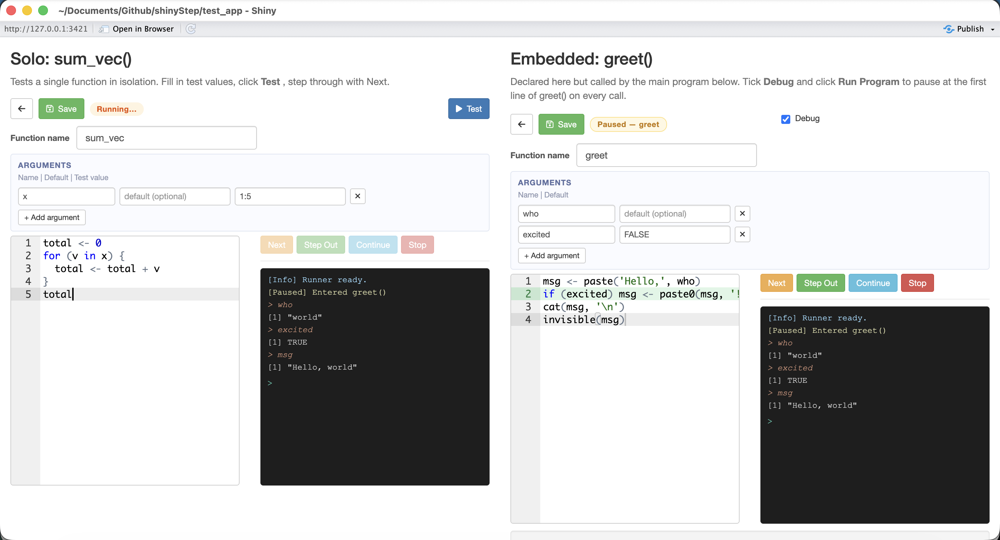

# shinyStep

`shinyStep` extends a Shiny app with embeddable code editors that let users write and run custom R functions directly inside the app. It is designed for apps that expose user-defined extension points — functions that plug into the app's built-in logic — so that non-trivial behaviour can be customised without touching the app's source code.

## Motivation

Custom functions do not run in isolation — they run *inside* the app, receiving arguments prepared by its engine, operating on its data structures, and called at moments controlled by its scheduler. Testing them outside the app in a plain R console means losing all of that context. Testing them inside the app with no tooling means `print()` statements and a full restart on every change.

A built-in debugger is therefore the natural solution: an editor and stepper that live inside the Shiny UI, so the user can step through their custom code expression-by-expression in the browser with all built-in app logic running around it, exactly as in production. Variables can be inspected at any point via an in-frame console; no server console or external IDE is needed.

Building a Shiny front-end for [TrialSimulator](https://github.com/zhangh12/TrialSimulator) is a concrete example. TrialSimulator is an R package for designing and simulating adaptive clinical trials; a Shiny app built on top of it naturally exposes the data generator of each endpoint and the action function of each milestone as user-defined extension points. `shinyStep` provides the in-app editors and debugger that let users write and test those functions while the full simulation engine runs around them.

---

## Two modes

`shinyStep` provides two module types that cover the main debugging scenarios:

| Mode | When to use | How it starts |
|:--|:--|:--|
| **Solo** | Test one function in isolation, independent of any surrounding program | Click **Test** — the package assembles `fn(arg = value, ...)` and runs it |
| **Embedded** | Debug a function that is called from a larger program the host app assembles | Tick **Debug**, then click Run in the host app — execution pauses at the first line of the function each time it is invoked |

Both modes share one runner. A single Shiny app can host any mix of solo and embedded editors.

---

## Screenshot



**Left — solo mode (`sum_vec`):** fill in test values, click **Test**, then step with **Next** / **Step Out** / **Continue**. The right pane shows output and accepts live expressions evaluated in the paused function's local environment.

**Right — embedded mode (`greet`):** tick **Debug**, then click **Run Program** in the host app. Execution pauses at the first line of `greet()` on every call. The status badge reads *Paused — greet* and the step controls activate.

---

## Installation

```r
remotes::install_github("zhangh12/shinyStep")
```

Requires `shiny >= 1.7.0` and `shinyAce >= 0.4.0`.

---

## Quick start

### Solo mode

```r
library(shiny)
library(shinyStep)

ui <- fluidPage(
  soloStepUI("running_sum", default_body =
    "total <- 0\nfor (v in x) {\n  total <- total + v\n}\ntotal")
)

server <- function(input, output, session) {
  runner  <- make_runner()
  run_log <- reactiveVal("")

  soloStepServer("running_sum", runner, run_log,
    initial_fn_name = "running_sum",
    initial_args    = list(
      list(name = "x", default = "", test_value = "c(1, 2, 3, 4, 5)")
    )
  )
}

shinyApp(ui, server)
```

Click **Test**, then **Next** to step through the loop. Type `total` in the console and press Enter to watch the running sum build up.

### Embedded mode

```r
library(shiny)
library(shinyStep)

ui <- fluidPage(
  textAreaInput("main_code", "Program", rows = 4, width = "100%",
                value = "result <- greet('world')\nprint(result)"),
  actionButton("run", "Run Program", class = "btn-primary"),
  embeddedStepUI("greet", default_body =
    "msg <- paste('Hello,', name)\nmsg")
)

server <- function(input, output, session) {
  runner  <- make_runner()
  run_log <- reactiveVal("")

  embeddedStepServer("greet", runner, run_log,
    initial_fn_name = "greet",
    initial_args    = list(list(name = "name", default = "'stranger'"))
  )

  observeEvent(input$run, {
    run_program(runner, main_code = input$main_code, run_log = run_log)
  })
}

shinyApp(ui, server)
```

Tick **Debug** on the `greet` editor, then click **Run Program**. Execution pauses at `msg <- paste(...)` inside `greet`.

---

## Editor conventions

The editor holds the **function body only** — no `fn_name <- function(...) { ... }` wrapper. Name and arguments live in structured inputs above the editor:

- **Function name** — a text input.
- **Arguments** — a table of `name | default | [test value]` rows with a "+ Add argument" button. The *test value* column appears in solo mode only and is used to build the `fn_name(arg = value, ...)` call when you click **Test**.

If you accidentally paste a full `fn <- function(args) { body }` definition into the editor, the package strips the wrapper and keeps the inner body.

---

## API

### `make_runner()`

Call once inside `server()`. Returns the shared runner object passed to every module and to `run_program()`.

---

### Solo module

```r
soloStepUI(id, label = id, height = "500px", theme = "textmate", default_body = "")

soloStepServer(id, runner, run_log,
               initial_fn_name = NULL,
               initial_body    = NULL,
               initial_args    = NULL,
               prelude         = NULL)
```

`soloStepServer` returns a named list:

| Handle | Type | Description |
|:--|:--|:--|
| `save_clicked` | reactive | fires on Save click |
| `back_clicked` | reactive | fires on Back click |
| `fn_name` | reactive | current function name |
| `get_fn_name()` | function | current name, isolated read |
| `get_body()` | function | current body, isolated read |
| `get_args()` | function | current args, isolated read |

**`prelude`** — optional character string or reactive prepended to the Test call. Use it to load packages or define helpers the function needs, e.g. `"library(dplyr)"`.

---

### Embedded module

```r
embeddedStepUI(id, label = id, height = "500px", theme = "textmate", default_body = "")

embeddedStepServer(id, runner, run_log,
                   initial_fn_name = NULL,
                   initial_body    = NULL,
                   initial_args    = NULL)
```

Same return value as `soloStepServer`, plus:

| Handle | Type | Description |
|:--|:--|:--|
| `enabled` | reactive | `TRUE` when the Debug checkbox is ticked |

---

### `run_program(runner, main_code, debug_targets = NULL, run_log)`

Execute `main_code` (a character string of R expressions).

| `debug_targets` | Behaviour |
|:--|:--|
| `NULL` (default) | pause at every embedded module whose Debug checkbox is ticked |
| `character(0)` | run to completion without pausing |
| `c("fn_a", "fn_b")` | pause at these names regardless of checkbox state |

Modules with a blank body are skipped silently; a reference to one in `main_code` produces a standard "could not find function" error.

---

### Step-control functions

Called by the built-in buttons; exported for advanced use (e.g. driving stepping programmatically from the host app).

| Function | Description |
|:--|:--|
| `step_fn(runner, run_log)` | Execute one expression; auto-expands compound blocks |
| `step_out_frame(runner, run_log)` | Exit the current loop or if/else block |
| `continue_to_next_pause(runner, run_log)` | Run until the next pause point or end |
| `stop_runner(runner, run_log)` | Abort execution |

---

## Features

- Handles `for`, `while`, `repeat`, `if` / `else if` / `else`, early `return()`, `break`, `next` at any nesting depth.
- In-frame console: evaluate any R expression in the paused function's local environment. Multi-line pastes run sequentially, matching R REPL behaviour.
- Green-arrow line highlight in the Ace editor. The `fn_name <- function(...) {` header is hidden; editor line numbers correspond 1-to-1 with the body you wrote.
- Works with functions called directly from `main_code` **and** functions invoked inside synchronous wrappers (e.g. a simulation controller's `$run()` method). When a proxy pauses it throws a typed condition that unwinds the call stack; Continue replays the wrapper with the just-debugged function in a skip list so execution resumes correctly.
- Solo modules are never auto-paused during an embedded `run_program()` call — they only pause via their own Test button.
- The Debug checkbox can be toggled live, even mid-run.

---

## Console keyboard shortcuts

| Key | Action |
|:--|:--|
| `Enter` | Submit expression |
| `↑` / `↓` | Navigate input history |
| `Ctrl+L` | Clear output log |

Selecting text in the output log copies it to the clipboard automatically.

---

## Test app

A working example combining both modes is in `test_app/`. It includes a packages prelude field, a solo editor for `sum_vec()`, and an embedded editor for `greet()` with an editable main program text area:

```r
shiny::runApp("test_app")
```
