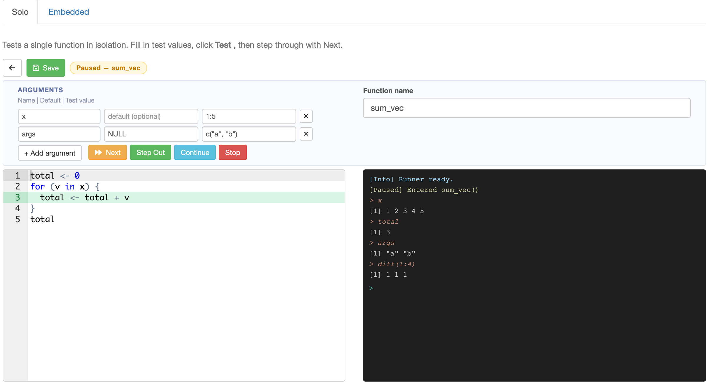
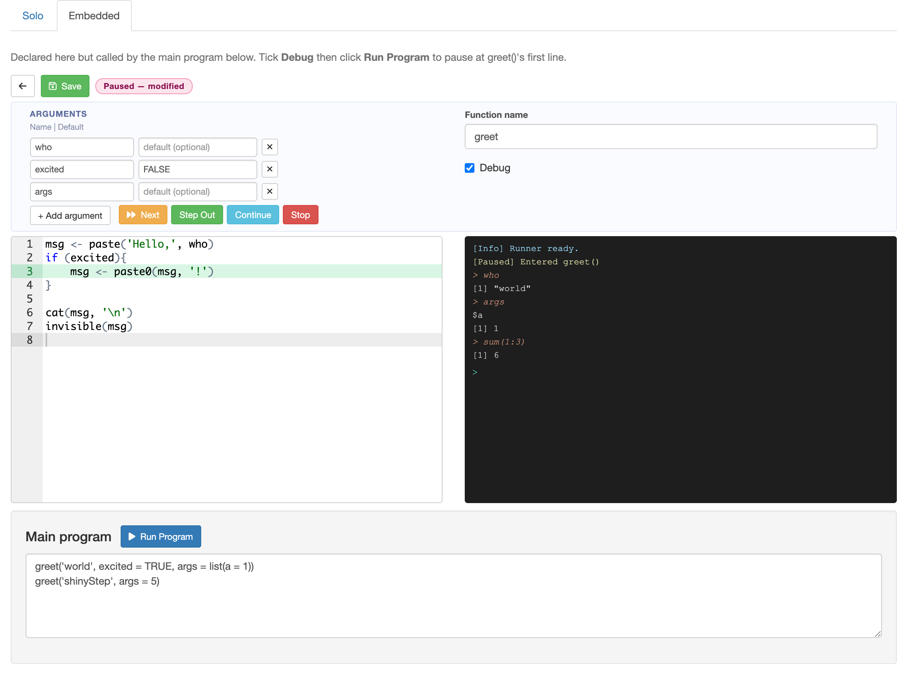

# shinyStep

**Let the users of your Shiny app bring their own R code.**

`shinyStep` is a pair of Shiny modules — one UI component, one server handler — that drop into any Shiny app and let the *end user* (not the developer) write R functions directly in the browser. Those functions become live extension points in the surrounding app: custom data generators, custom decision rules, custom post-processing, anything the developer deliberately exposes as pluggable.

The modules also happen to ship with a full in-browser step debugger — editor, argument table, Ace highlight, console, step controls — because nobody writes working code on the first try. The debugging is a tool for the user: it lets them step through their own function *inside* the running app, with the engine feeding it real arguments and real state, not a contrived test harness — so the bug that only shows up mid-simulation is the one they get to inspect.

## Why this exists

A Shiny app with baked-in logic is a tool. A Shiny app that lets its users write the interesting parts becomes a platform.

Take a concrete case: [TrialSimulator](https://github.com/zhangh12/TrialSimulator) simulates adaptive clinical trials. Every trial has its own endpoint distributions and its own interim-analysis rules — these are not knobs on a form, they are *code*. A Shiny front-end for TrialSimulator that only lets users pick from a dropdown of ten built-in distributions is a toy. A front-end that lets a statistician paste in their own hazard function or their own interim rule is the real thing. `shinyStep` is what makes the second one possible without forcing the user to clone a repo, edit a file, and restart R.

Developer's job: decide which extension points the app exposes, and call the user's function from the engine.
User's job: write the function in a browser tab, step through it until it behaves, tick off, move on.

## How it works at a glance

Two module types cover the two ways a user function gets invoked:

| Mode | Test context | Use it for | Kicked off by |
|:--|:--|:--|:--|
| **Solo** | Self-contained — behaviour fully determined by the arguments; a few literal test values give a faithful test. | A custom endpoint generator in a clinical-trial simulator, a dose-escalation decision rule, a utility reshaper. | **Test** button in the module. Runs `fn(arg = test_value, …)` and pauses at line 1. |
| **Embedded** | Context-dependent — inputs only exist mid-run (a partially-simulated trial, a fitted model, accumulated state); debug *while* the host program is running. | A crossover rule in a trial, a log-likelihood passed to `optim()`, a post-processing hook that summarises intermediate state. | **Debug** checkbox in the module + host app triggers `run_program()`. Execution pauses at line 1 of the function every time the program calls it. |

A single app can host any mix of both. They share one runner, so behaviour stays consistent across the app.

**When the user is done debugging,** they simply *untick* the Debug checkbox and hit the host app's Run button again — the function runs to completion without pausing. The same module is both the authoring surface (while writing) and an invisible registration point (while running for real). There is no "ship it" step.

---

## Installation

```r
remotes::install_github("zhangh12/shinyStep")
```

Requires `shiny >= 1.7.0` and `shinyAce >= 0.4.0`. No other dependencies.

---

## See it running

A full demo with both modes, a shared packages prelude, and a host program ships inside the installed package under `inst/test_app/`. Launch it from any R session with:

```r
shinyStep::run_demo()
```

Or, from a source checkout:

```r
shiny::runApp("inst/test_app")
```

The screenshots below are taken straight from this app — the solo tab edits `sum_vec`, the embedded tab edits `greet` and calls it from the Main program panel.

### Solo mode



The user fills in each argument's **Test value** — here `x = 1:5` and `args = c("a", "b")` — clicks **Test**, and the function pauses at line 3 (green arrow in the Ace gutter). The status badge reads *Paused — sum_vec*. The right-hand pane is a console rooted in the paused function's local environment: typing `x`, `total`, or `args` prints the current values, and arbitrary expressions like `diff(1:4)` evaluate in place.

### Embedded mode



The user declares `greet()` in the embedded editor and ticks **Debug** (left-aligned under **Function name**). The host app supplies the Main program panel at the bottom — `greet('world', excited = TRUE, args = list(a = 1))` followed by `greet('shinyStep', args = 5)` — and clicking **Run Program** next to the *Main program* heading sends the whole thing through the shared runner. Execution pauses at `greet()`'s first line on every call. The console inspects `who`, `args`, `sum(1:3)` as the function sees them.

When the user is satisfied, they untick **Debug** and click **Run Program** again — the program now runs end-to-end with `greet()` participating normally.

---

## Quick start

### Solo mode — a sanity-check editor for a single function

```r
library(shiny)
library(shinyStep)

solo_body <- paste(
  "total <- 0",
  "for (v in x) total <- total + v",
  "total",
  sep = "\n"
)

ui <- fluidPage(
  soloStepUI("running_sum",
             default_body    = solo_body,
             default_fn_name = "running_sum")
)

server <- function(input, output, session) {
  runner  <- make_runner()
  run_log <- reactiveVal("")

  soloStepServer("running_sum",
                 runner  = runner,
                 run_log = run_log,
                 initial_fn_name = "running_sum",
                 initial_args    = list(
                   list(name = "x", default = "", test_value = "c(1, 2, 3, 4, 5)")
                 ))
}

shinyApp(ui, server)
```

Click **Test**, then **Next** to step through the loop. Type `total` in the console at any pause to watch the running sum build up.

### Embedded mode — a user function called from a host program

```r
library(shiny)
library(shinyStep)

greet_body <- paste(
  "msg <- paste('Hello,', name)",
  "if (excited) msg <- paste0(msg, '!')",
  "msg",
  sep = "\n"
)

ui <- fluidPage(
  embeddedStepUI("greet",
                 default_body    = greet_body,
                 default_fn_name = "greet"),
  wellPanel(
    div(style = "display:flex; align-items:center; gap:12px;",
        h4("Main program", style = "margin:0;"),
        actionButton("run", "Run Program",
                     icon = icon("play"), class = "btn-primary btn-sm")),
    textAreaInput("main_code", label = NULL, rows = 3, width = "100%",
                  value = "print(greet('world', excited = TRUE))")
  )
)

server <- function(input, output, session) {
  runner  <- make_runner()
  run_log <- reactiveVal("")

  embeddedStepServer("greet",
                     runner  = runner,
                     run_log = run_log,
                     initial_fn_name = "greet",
                     initial_args    = list(
                       list(name = "name",    default = "'stranger'"),
                       list(name = "excited", default = "FALSE")
                     ))

  observeEvent(input$run, {
    run_program(runner, main_code = input$main_code, run_log = run_log)
  })
}

shinyApp(ui, server)
```

Tick **Debug** on the `greet` module, click **Run Program** — execution pauses at `msg <- paste(...)`. Step through with **Next**. When you are happy with the function, untick **Debug** and click **Run Program** again: the program runs through without pausing and the final `msg` prints.

---

## Using `shinyStep` as a component

Both modules are **standard Shiny modules** (a `*UI()` / `*Server()` pair with an `id`, the same pattern as Shiny's own module system). They compose like any other module:

- Drop `soloStepUI(id)` / `embeddedStepUI(id)` anywhere in your layout — inside `fluidPage`, `navbarPage`, `tabsetPanel`, `tabItems`, a `bslib::card`, a custom `div`, a hidden panel switched via JS. No top-level requirements, no singletons.
- Call the matching `*Server(id, ...)` inside your `server()`. `make_runner()` is called *once* per session and handed to every module and to `run_program()`.
- `run_log` is a shared `reactiveVal(character(1))` that collects output from every module and from the host program. Render it wherever you want (`verbatimTextOutput` tied to `run_log()`), or ignore it if you only care about the in-module console.

> This is a Shiny **module**, not an [htmlwidget](https://www.htmlwidgets.org/) — it is R/Shiny all the way down, not a JS binding around an external library. So it lives in ordinary Shiny UIs, not in R Markdown / Quarto standalone HTML outputs.

You can mount many editors side-by-side (one per user-defined extension point), show/hide them via Shiny's standard UI mechanisms, and they stay coherent because they all push through the same runner.

---

## Editor conventions

The editor holds the **function body only** — no `fn <- function(...) { ... }` wrapper. Name and arguments live in structured inputs above the editor:

- **Function name** — a text input (right column of the header card).
- **Debug** (embedded only) — a checkbox under the function name, left-aligned. Toggling it is live: you can tick it mid-session and the next call pauses.
- **Arguments** — a table of `name | default | [test value]` rows with a **+ Add argument** button. The *test value* column appears in **solo mode only** and feeds the `fn(arg = value, …)` call built by Test.

If a user pastes a full `fn <- function(args) { body }` definition by habit, the package strips the wrapper and keeps the inner body — it will *not* create a nested function.

---

## API

### `make_runner()`

Call once inside `server()`. Returns the shared runner object passed to every module and to `run_program()`.

---

### Solo module

```r
soloStepUI(id, label = id, height = "500px", theme = "textmate",
           default_body = "", default_fn_name = "")

soloStepServer(id, runner, run_log,
               initial_fn_name = NULL,
               initial_body    = NULL,
               initial_args    = NULL,
               prelude         = NULL,
               reserved_args   = NULL)
```

`soloStepServer` returns a named list:

| Handle | Type | Description |
|:--|:--|:--|
| `save_clicked` | reactive | fires on Save click |
| `back_clicked` | reactive | fires on Back click |
| `fn_name` | reactive | current function name |
| `get_fn_name()` | function | current name, isolated read |
| `get_body()` | function | current body, isolated read |
| `get_args()` | function | current args, isolated read |

- **`prelude`** — optional character string or reactive prepended to the Test call. Use for package loads or helper definitions the user function needs (e.g. `"library(dplyr)"`). Accepts a reactive so preludes can be driven by UI inputs (tick a package → it is loaded on every Test).
- **`reserved_args`** — optional list of reserved-argument specs. Each entry pins one row at the top of the argument table: the name field is readonly, the delete button is hidden, and the user cannot rename, remove, or reorder it. Entries may be a bare name (`"n"`) or a list with `name`, `allow_default` (default `TRUE`), and `allow_test_value` (default `TRUE`). Use the bare-name form when the host engine always injects an argument (e.g. a simulator that passes `n` into every generator). Disallowing both value fields is unusual but useful when the host supplies the argument at call time, e.g. `list(list(name = "trial", allow_default = FALSE, allow_test_value = FALSE))`.

---

### Embedded module

```r
embeddedStepUI(id, label = id, height = "500px", theme = "textmate",
               default_body = "", default_fn_name = "")

embeddedStepServer(id, runner, run_log,
                   initial_fn_name = NULL,
                   initial_body    = NULL,
                   initial_args    = NULL)
```

Same return value as `soloStepServer`, plus:

| Handle | Type | Description |
|:--|:--|:--|
| `enabled` | reactive | `TRUE` when the Debug checkbox is ticked |

---

### `run_program(runner, main_code, debug_targets = NULL, run_log)`

Execute `main_code` (a character string of R expressions) through the shared runner.

| `debug_targets` | Behaviour |
|:--|:--|
| `NULL` (default) | pause at every embedded module whose **Debug** checkbox is ticked |
| `character(0)` | run to completion without pausing — same as unticking every box |
| `c("fn_a", "fn_b")` | pause at these function names regardless of checkbox state |

Modules with a blank body are skipped silently; a reference to one in `main_code` produces a standard "could not find function" error.

---

### Step-control functions

Called by the built-in buttons; exported for advanced use (e.g. driving stepping programmatically from the host app, or binding custom keyboard shortcuts).

| Function | Description |
|:--|:--|
| `step_fn(runner, run_log)` | Execute one expression; auto-expands compound blocks |
| `step_out_frame(runner, run_log)` | Exit the current loop or `if`/`else` block |
| `continue_to_next_pause(runner, run_log)` | Run until the next pause point or end |
| `stop_runner(runner, run_log)` | Abort execution |

---

## What the debugger actually handles

- `for`, `while`, `repeat`, `if` / `else if` / `else`, early `return()`, `break`, `next` — at any nesting depth.
- **In-frame console**: any R expression in the paused function's local environment. Multi-line pastes run sequentially, matching the R REPL.
- **Green-arrow line highlight** in the Ace editor. The synthetic `fn <- function(...) {` header is hidden; editor line numbers map 1-to-1 with the body the user wrote.
- **Wrapped calls**: the function still pauses correctly when it is invoked inside a synchronous controller (e.g. a simulator's `$run()` method that drives many calls internally). Continue replays the wrapper with the just-debugged function on a skip list, so execution resumes cleanly instead of re-pausing on the same call.
- **Live Debug toggle**: tick or untick during a run — the next invocation respects the new state.
- **Solo modules never auto-pause** during a host-driven `run_program()`. They exist only to exercise a function in isolation via their own Test button, so they stay out of the way when the host program runs.

---

## Console keyboard shortcuts

| Key | Action |
|:--|:--|
| `Enter` | Submit expression |
| `↑` / `↓` | Navigate input history |
| `Ctrl+L` | Clear output log |

Selecting text in the output log copies it to the clipboard automatically.

